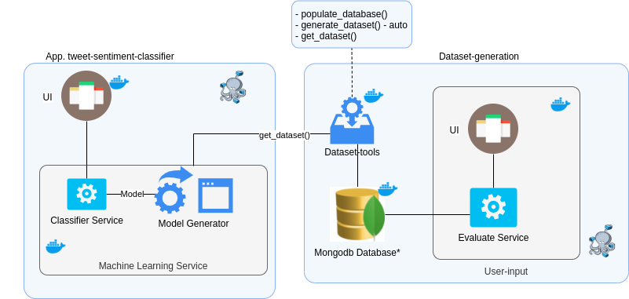

# tweets-sentiment-classification-system
An application that generates an incremental dataset from user inputs and a classifier that uses this dataset to classify tweets (under development).

*(pt-br)* Nesse projeto, pretende-se unir algumas aplicações já existentes criadas como sistemas independentes em um único sistema.

As aplicações com seus repositórios são as seguintes:

## Classificador de sentimentos de twets
- ``Classifier application``: Aplicação backend com Flask e frontend React que realiza predições de sentimentos de tweets: https://github.com/Juliano-rb/tweets-classifier-flask-react.
- ``Model generator``: Aplicação que gera um modelo pronto para ser utilizado pela aplicação anterior a partir de um dataset de tweets.

## Gerador de dataset
- ``UI``: Interface de usuário para alimentar o dataset com sua avaliação sobre tweets https://github.com/Juliano-rb/tweet-dataset-creator-client.
- ``Evaluate Service``: Serviço que onde a ``UI`` se conecta para alimentar a base de dados mongodb e buscar tweets https://github.com/Juliano-rb/tweet-dataset-creator-api 
- ``Dataset-tools``: Ferramentas para pre-alimentar o banco de dados com tweets novos e gerar o dataset final (.csv) https://github.com/Juliano-rb/fetch-tweets-to-mongodb

## Road-map
- [x] Dockenizar Classificador de sentimentos de twets
- [x] Dockenizar ``mongodb database``para subir junto do sistema SE o usuário desejar.
- [ ] Transformar ``dataset-tools`` em um serviço que possa servir um dataset novo quando necessário.
- [ ] Modularizar o ``model generator`` para facilitar seu uso programaticamente.
- [ ] Criar uma rota no Aplicativo classificador para atualizar o modelo existente.
- [ ] Fazer o ``model generator`` consumir a api do ``dataset-tools`` para gerar novos modelos
- [ ] Melhorar o ``model generator``para tratar melhor os dados
- [ ] Melhorar ``classifier application``
